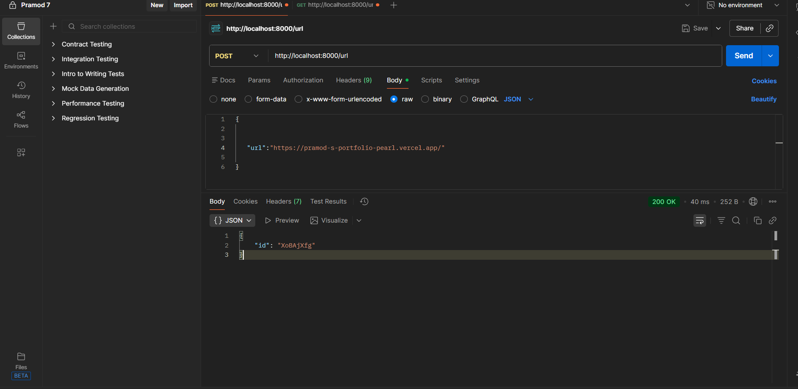
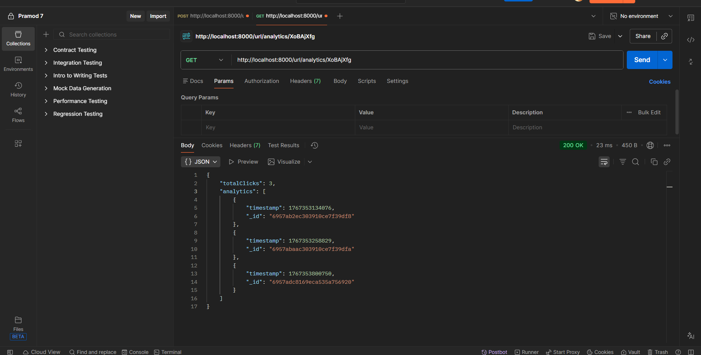

## 🔗 Shortify — URL Shortening Service

**Shortify** is a lightweight and scalable URL shortening service that transforms long URLs into short, easy-to-share links and efficiently redirects users to their original destinations. The project focuses on clean backend architecture, performance optimization, and reliable data handling.

### 🚀 Features

* Generate short, unique URLs from long links
* High-performance redirection using HTTP 301/302
* RESTful API with structured routing and controllers
* Collision-safe short code generation
* Input validation and centralized error handling
* Designed for scalability and high-traffic scenarios

### 🛠️ Tech Stack

* **Backend:** Node.js, Express.js
* **Database:** MongoDB / MySQL
* **API Style:** REST
* **Architecture:** MVC / Layered Architecture

### 📌 Use Cases

* Simplifying long URLs for sharing
* Backend system design and API development practice
* Learning scalable data modeling and redirection logic

### 🎯 Project Objective

Shortify demonstrates real-world backend development skills including API design, database interactions, performance-focused redirects, and scalable system thinking—making it a strong portfolio project for software engineering roles.

---
## 📁 Project Structure

```bash
Shortify/
├── CONTROLLERS/
│   └── url.controller.js       # Business logic for URL creation and analytics
│
├── MODELS/
│   └── url.model.js            # Mongoose schema for shortened URLs
│
├── ROUTES/
│   ├── staticRoutes.js         # Routes for rendering static pages (EJS views)
│   └── url.routes.js           # API route definitions
│
├── VIEWS/
│   └── home.view.ejs           # Home page template
│
├── Connection.js               # MongoDB connection setup
├── image-1.png                 # Project screenshots/assets
├── image.png                   # Project screenshots/assets
├── index.js                    # Application entry point
├── package.json                # Project metadata and dependencies
├── README.md                   # Project documentation
                 
```

### 📈 Future Enhancements

* Click analytics and usage tracking
* Custom short URLs
* URL expiration support
* Authentication and user-based link management
* Rate limiting and security enhancements

## client side rendering via-Post-Man


